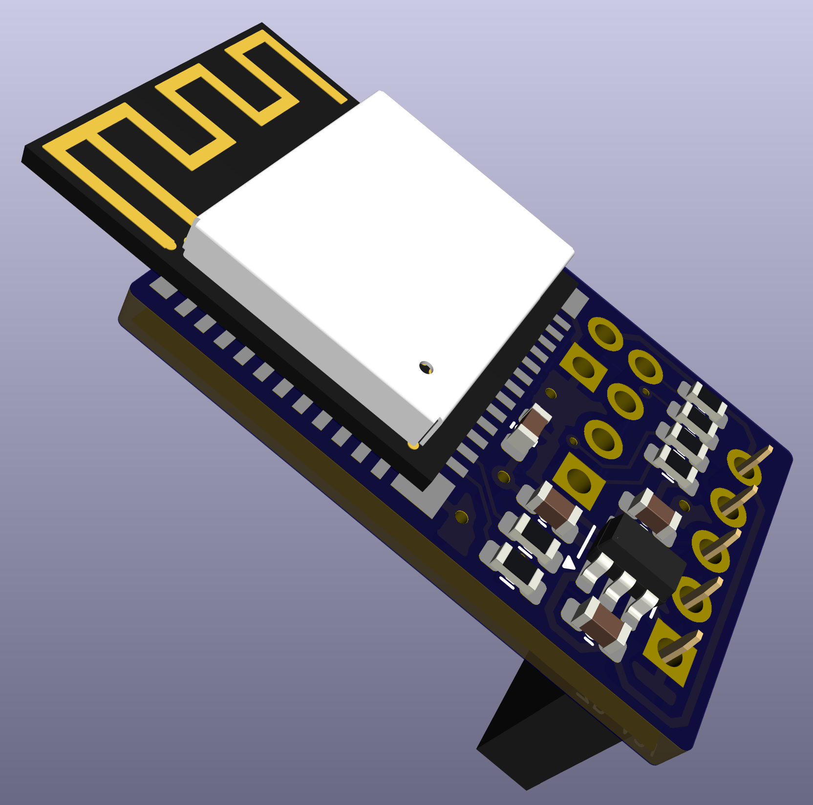
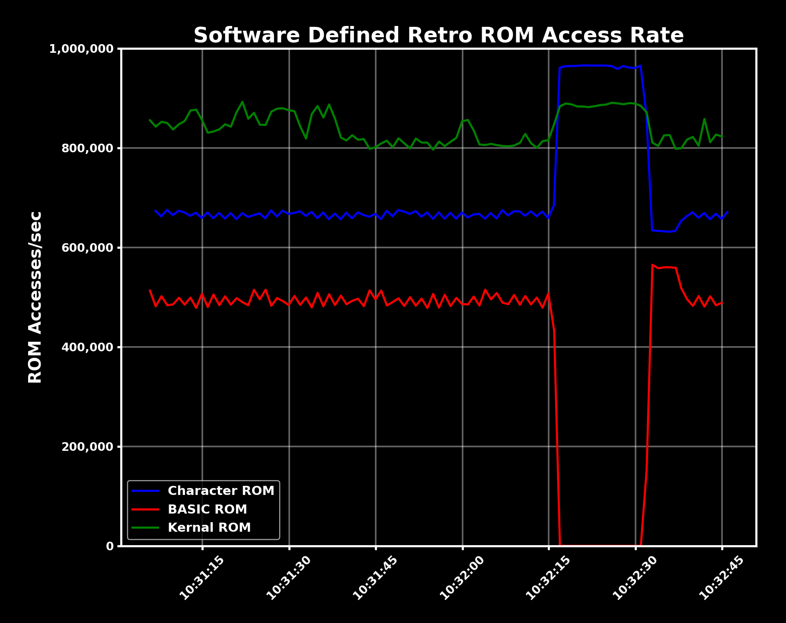

# Airfrog

[piers.rocks/u/airfrog](https://piers.rocks/u/airfrog)

Tiny wireless co-processor/programmer/debugger for ARM.  Uses $3 WiFi module.  Written in Rust.

* **Tiny**: Coin sized 16×28mm
* **Wireless**: No cables
* **Low Cost**: $3 ESP32-C3 module
* **Open**: Fully open source

## Hardware

The size of a postage stamp/quarter.  $3 BOM.  Hand solderable.

<div align="center">
  
</div>

## Use Cases and Features

| Use Case | Description |
|----------|-------------|
| **Co-Processing** | Augment MCU with additional processing power - including direct access to the MCU's hardware resources |
| **Stealth Control**      | Control devices without physical access to the target device or the MCU's knowledge |
| **Remote Telemetry**     | Transmit flash, RAM and peripheral data from device over WiFi |
| **Live Re-programming**  | Program devices while they are running, over WiFi |
| **Wireless Debugging**   | Debug devices over WiFi - no physical access required |

## Key Features
| Feature | Description |
|---------|-------------|
| **Default firmware** | Access ARM MCU's RAM/flash/peripherals via web/REST/binary interfaces over WiFi |
| **Custom firmware** | Quickly develop custom apps using Airfrog libraries and [examples](examples/README.md) |
| **Super-fast boot** | Airfrog transmits data from the target device within 5 seconds of power on |
| **Existing tooling integration** | Compatible with [probe-rs](https://probe.rs/) for programming and debugging. |
| **STM32 support** | Tested and works with STM32F4 ARM targets. |
| **Highly controllable** | Erase/reflash firmware while target is running, halt/reset target, read/write RAM/flash/peripherals |

## Quick Start

To install the default Airfrog firmware:

1. Install the [dependencies](BUILD.md#dependencies)

2. Connect the [Airfrog](pcb/README.md) via USB serial

3. Build and flash the [default firmware](airfrog/README.md)
    ```bash
    AF_STA_SSID=your-ssid AF_STA_PASSWORD=your-password cargo run --release -p airfrog
    ```

4. Point a browser to `http://airfrog-ip/` (IP from DHCP) to access the web interface

## Coming Soon

* [OTA upgrades of Airfrog firmware](https://github.com/piersfinlayson/airfrog/issues/1)
* [Support for more ARM targets](https://github.com/piersfinlayson/airfrog/issues?q=is%3Aissue%20state%3Aopen%2011%20OR%2012%20OR%2013%20OR%2014)
* [Memory viewer enhancements](https://github.com/piersfinlayson/airfrog/issues/2)
* [Run STA and AP modes in parallel](https://github.com/piersfinlayson/airfrog/issues?q=is%3Aissue%20state%3Aopen%20%236%20OR%20%235%20OR%20%234)
* [Support target RTT logging](https://github.com/piersfinlayson/airfrog/issues/9)

## Technical Summary

Firmware:

* Built from the ground-up in Rust using [embassy](https://embassy.dev/) and [esp-hal](https://github.com/esp-rs/esp-hal) for speed and reliability
* Web, REST and binary interfaces provided out of the box
* Supports SWD protocol at configurable speeds between 500KHz - 4MHz
* Supports controlling [Software Defined Retro ROM](https://piers.rocks/u/sdrr)
* Default firmware uses IPv4 and DHCP for network configuration and supports captive AP for easy setup
* Build custom firmware using libraries and [examples](examples/README.md) provided
* Integration with [probe-rs](https://probe.rs/) for programming and debugging tasks
* Fully open source, no closed source dependencies

Hardware:

* [ESP32-C3-MINI-1](https://www.espressif.com/sites/default/files/documentation/esp32-c3-mini-1_datasheet_en.pdf) RISC-V core with integrated WiFi, RAM and flash
* 5-pin 0.1" pitch connector to power Airfrog and connecting to target ARM devices
* Exposes separate UART for Airfrog firmware programming
* Powered by 5V, includes on-board 3.3V regulator
* SWD pins 3.3V
* All passives 0603 for hand soldering
* 2-layer PCB, default single sided assembly
* Fully open-source, no restrictions on commercial use

## Documentation

* [FAQ](docs/FAQ.md) - frequently asked questions
* [Build Instructions](BUILD.md) - build and flash the default firmware
* [PCB Designs](pcb/README.md) - design or fab your own Airfrog
* [Technical Overview](docs/TECHNICAL.md) - how Airfrog works
* [Examples](examples/README.md) - start here for building custom Airfrog applications
* [Software](docs/SOFTWARE.md) - start here to use Airfrog with existing SWD tools
* [REST API](docs/API.md) - to interact with the default Airfrog firmware via web APIs
* [Binary API](docs/BINARY_API.md) - Airfrog's highest performance network API
* [SWD Protocol](docs/SWD.md) - to understand the core SWD protocol
* [Changelog](CHANGELOG.md)
* [Licence](LICENCE.md)

## Example Use Case - Remote Telemetry

Airfrog is used to add remote telemetry support to the [Software Defined Retro ROM (SDRR) ](https://piers.rocks/u/sdrr) which is based on the STM32F4 ARM MCU.

SDRR has no network interface or spare MCU cycles to transmit data, so Airfrog is installed.  It reads a counter directly from the MCU's RAM and sends it via MQTT over WiFi to be graphed on a remote system.

Airfrog can also be used to dynamically control SDRR during run-time, and reprogram it over WiFi.

This [demonstration](examples/mqtt.rs) was developed in 2-3 hours with
- 200 lines of Rust for the Airfrog firmware
- 90 lines of Python to produce the real-time graph.



If you are interested in precisely what is being shown here:
- Three SDRRs are installed in a Commodore 64, operating as Kernal, BASIC and Character ROMs repspectively.
- SDRR increments a counter in its RAM every time that ROM's chip select line(s) are asserted.
- Airfrog reads that counter directly from the MCU RAM every second.  It subtracts it from the previous value (to get a 1Hz sample rate) and sends it to an MQTT broker.
- The Python script subscribes to the appropriate MQTT topics and plots the data in real-time using `matplotlib`.

## Contributing

Contributions are welcome!
* [Report an issue](https://github.com/piersfinlayson/airfrog/issues)
* [Submit a PR](https://github.com/piersfinlayson/airfrog/pulls)

## Licence

* Software: [MIT Licensed](LICENCE#mit-license)
* Hardware: [CC-BY-SA-4.0](LICENCE#cc-by-sa-4.0)
