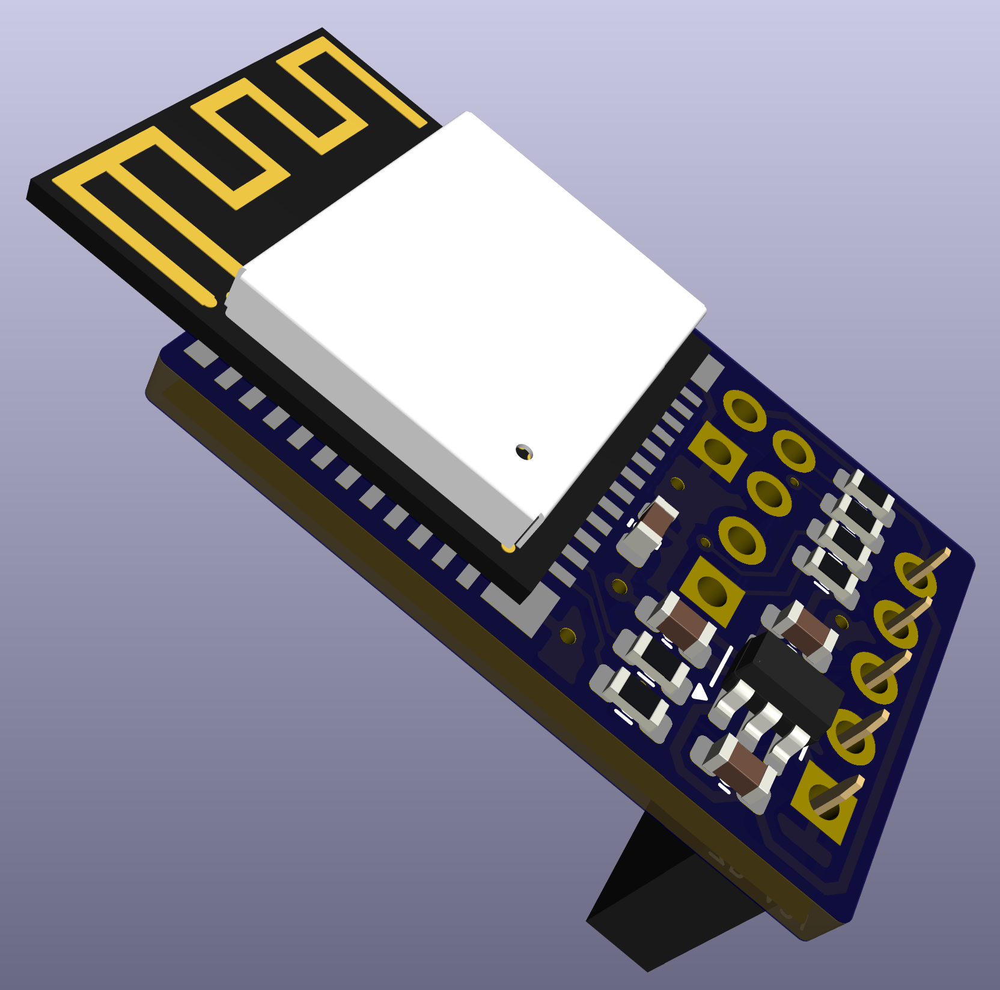

# airfrog-swd PCB FIles

**Unverified** The rev a PCB has been verified.  However, the CPL/BOM files have not been verified.

This directory contains the hardware design files for rev a2 of the SWD variant of the airfrog programmer.

This version is designed to connect to a [Software Designed Retro ROM](https://piers.rocks/u/sdrr) rev d/e/f/f2.

#

## Schematic

- [Schematic](airfrog-rev-a-schematic.pdf)

## Fab Files and BOM

- [Gerbers](fab/airfrog-rev-a2-gerbers.zip)
- [CPL](fab/airfrog-rev-a2-top-pos.csv)
- [BOM](fab/airfrog-rev-a2-bom.csv)
- [Fab Notes](fab/airfrog-rev-a-fab-notes.pdf)

If using JLCPCB for assembly, note that JLC PCB do not place the ESP32-C3-MINI-1 as part of their standard assembly service - you would either need to source and solder this by hand, or opt for the more advanced assembly service which includes this component.  The minimum PCB size for advanced assembly is 70x70mm - so you would also need to panelize and v-cut the PCB.

J1, J2, J3 and U1 will show up as unplaced when using JLCPCB - the J* jumpers as through hole components, and U1 as the ESP-C3-MINI-1.  You will need to source these components separately, or use the advanced assembly service.

## Errata

- The two rows of holes for programming the Airfrog are not quite 0.1" apart.  It has proved easiest to use right angle headers for these 6 (2+4) pins, squeezing the two rows together slightly to fit them into the holes.
