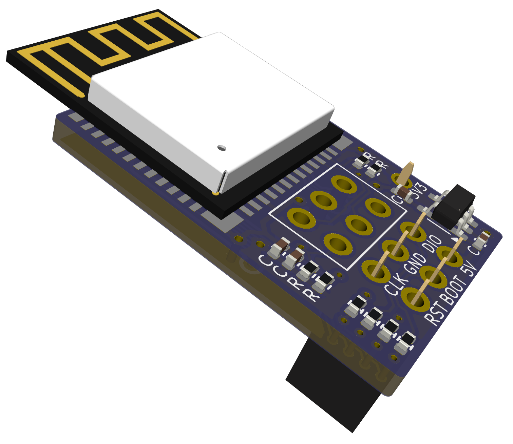

# airfrog-swd PCB FIles

**Verified** The rev b PCB has been verified.  The BOM/POS files have not - if using, pay particular attention to rotation of any parts.

This directory contains the hardware design files for rev b of the SWD variant of the airfrog programmer.

This version is designed to connect to a [Software Designed Retro ROM](https://piers.rocks/u/sdrr) rev g onwwards, or Pico/Pico 2.

#

## Schematic

- [Schematic](airfrog-rev-b-schematic.pdf)

## Fab Files and BOM

- [Gerbers](fab/airfrog-rev-b-gerbers.zip)
- [CPL](fab/airfrog-rev-b-top-pos.csv)
- [BOM](fab/airfrog-rev-b-bom.csv)
- [Fab Notes](fab/airfrog-rev-b-fab-notes.pdf)

If using JLCPCB for assembly, note that JLC PCB do not place the ESP32-C3-MINI-1 as part of their standard assembly service - you would either need to source and solder this by hand, or opt for the more advanced assembly service which includes this component.  The minimum PCB size for advanced assembly is 70x70mm - so you would also need to panelize and v-cut the PCB.

## Changes

Changes from previous version:

- Moved to 0402 passives
- Moved to 2x3 target programming header, for compatibility with One ROM rev G onwards, and Pico/Pico 2.
- Implemented 2x3 self programming header, so can be programmed by another Airfrog.
- Removed SWD/UART resistors - traces can be cut and resistors populated if necessary.

## Errata

